# Complete the Square

A 5x5 board game with an AI that runs in your browser.
**[Play it](https://Guppy16.github.io/CompleteTheSquare/)** · [How the AI works](docs/README.md)

Two players take turns placing a piece on an empty square. Place a piece so that a run of
the opponent's pieces sits between it and one of yours, in any of the eight directions,
and the run is captured. Own all four corners of any square (2x2 up to 5x5) and you win.
Adapted from [VatsalRaina/CompleteTheSquare](https://github.com/VatsalRaina/CompleteTheSquare).

<p align="center">
  
</p>

<p align="center"><sub>A real game, animated from the engine. The orange rings are the engine's top candidates
before each move, as in the Analysis tab; the bar is its evaluation for green.</sub></p>

## The engine

The rules and the AI are a Rust crate in [`wasm/`](wasm/), compiled to WebAssembly
([`square-game/ai.wasm`](square-game/ai.wasm), committed, so the site deploys with no build
step). No dependencies. Bitboards, alpha-beta search with quiescence and a transposition
table keyed by the board's symmetries, an opening book computed offline, and a
multi-threaded search for the offline tools. Each idea has its own page in
[docs/](docs/README.md), with the code and a worked example.

| file | holds |
|------|-------|
| [`wasm/src/game.rs`](wasm/src/game.rs) | board state, moves, captures, win detection, symmetry tables |
| [`wasm/src/search.rs`](wasm/src/search.rs) | evaluation, the search, the transposition table, the opening book |
| [`wasm/src/parallel.rs`](wasm/src/parallel.rs) | multi-threaded search (native tools only) |
| [`wasm/src/lib.rs`](wasm/src/lib.rs) | the game session and every function the page calls |
| [`wasm/tests/`](wasm/tests/) | regression tests, including parallel-versus-serial agreement |
| [`wasm/examples/`](wasm/examples/) | the tools below |

```bash
python3 -m http.server 3000                    # serve the page locally: http://localhost:3000/
rustup target add wasm32-unknown-unknown       # once
cd wasm
cargo test --release                           # all tests
./build.sh                                     # rebuild square-game/ai.wasm
```

Tools (all `cargo run --release --example ...` from `wasm/`):

| tool | what it does |
|------|--------------|
| `analyse -- "1. C3 A1  2. B2 D4" 10 16` | replay a game: what the engine would have played, every move scored, the expected line; depth 10, 16 threads |
| `arena -- 10 200` | the AI as red against a human-like opponent (10% blunders, 200 games): the strength number |
| `validate_reply -- C3 A1 C5 40` | check opening-book candidates by play |
| `bench -- 11 1 4 16` | timing of the parallel search |
| `diagram -- --moves "1. A1 C3" --mark B2` | a board as SVG, for the docs |
| `tree_diagram -- --green A1,C1 --red B1` | a two-ply search tree with a board at every node |
| `animate_game -- "1. A1 E1 2. A2"` | an animated SVG of a game, like the one above |

## Findings

- The AI beats a depth-5 opponent that blunders 10% of the time in 96 to 98 games of 100.
- **A1 (a corner) is a first-player win** at depth 16: every red reply loses. The other
  five distinct first moves are not: B1 and C3 are draws by repetition with best play, C1
  and B2 leave green slightly better, C2 is level. Details on the
  [opening book page](docs/14-opening-book.md).
- From any short opening at equal engine strength, the side to move wins over 90% of games:
  this game is decided by tempo from the first moves.

## To do

- Book entries one ply deeper: red's best answer to each of green's second moves.
- Tests for the exports the tests don't yet cover (`analyse`, `evaluate`, `ai_suggest`,
  `board_at`, `repetitions`, the node-budget abort).
- Late move reductions, only if more strength is ever wanted.
- A variation tree in the move list; remembering the game across reloads.
