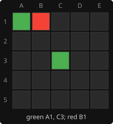

# 1. Bitboards

**Code:** [`wasm/src/game.rs`](../wasm/src/game.rs): `State`, `square_bit`, `bit_index`, `FULL_MASK`.

## The idea

A 5x5 board has 25 squares, so the set of squares one player occupies fits in a single
integer with one bit per square. Square `(row, col)` is bit number `row * 5 + col`:

```
bit index          as a board
 0  1  2  3  4     row 1   (A1 B1 C1 D1 E1)
 5  6  7  8  9     row 2
10 11 12 13 14     row 3
15 16 17 18 19     row 4
20 21 22 23 24     row 5
```

A position is two such integers plus whose turn it is:

```rust
pub struct State {
    pub boards: [u32; PLAYERS],   // boards[0] = green's pieces, boards[1] = red's
    pub current: usize,           // 0 or 1: who moves next
}

pub const fn square_bit(row: usize, col: usize) -> Bit { 1 << (row * COLS + col) }
pub fn bit_index(bit: Bit) -> usize { bit.trailing_zeros() as usize }
```

Board questions become single CPU instructions:

| question | expression |
|----------|------------|
| all occupied squares | `boards[0] \| boards[1]` (`State::occupied`) |
| all empty squares | `!occupied & FULL_MASK` (`State::empty`) |
| is square `b` free | `occupied & b == 0` |
| does a player own all four corners of a square | `board & mask == mask` |
| how many pieces | `board.count_ones()` |

`FULL_MASK` is `(1 << 25) - 1`, i.e. 25 ones. It is needed because `!occupied` also sets
the seven unused high bits of the `u32`; masking keeps only real squares.

## Worked example

Green on A1 and C3, red on B1:



```
green = bit 0 | bit 12 = 0b1_0000_0000_0001 = 4097
red   = bit 1          = 2
occupied = 4099
empty = !4099 & FULL_MASK = 33554432 - 1 - 4099 = 33550332  (22 squares)
```

Is C3 free? `4099 & (1 << 12)` is non-zero, so no.

## The position key

Repetition checks and the transposition table need one integer per position.
`State::key` packs both boards and the side to move into a `u64`:

```rust
pub fn key(&self) -> u64 {
    (self.boards[0] as u64) | ((self.boards[1] as u64) << N) | ((self.current as u64) << (2 * N))
}
```

Green in bits 0 to 24, red in bits 25 to 49, the side to move in bit 50. Two positions
are equal exactly when their keys are equal. Including the side to move matters: the
same pieces with the other player to move is a different position, as in chess.

## Why it matters

Every technique that follows runs on these integers. Move generation, captures, win
detection, the evaluation and the symmetry transforms are all a few AND, OR and shift
operations per position, which is why the search visits about six million positions a
second on one core.

---

<sub>[index](README.md) · [2. Move generation](02-move-generation.md) →</sub>
