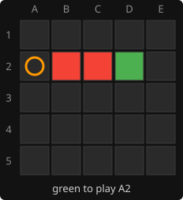
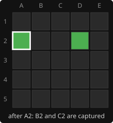

# 3. Captures and wins

**Code:** [`wasm/src/game.rs`](../wasm/src/game.rs): `build_tables` (the `capture_rays` and `corner_masks`
parts), `remove_pieces`, `winning_mask`, `play_move`.

## The rules

- **Capture:** after placing a piece, look along each of the 8 directions. If there is a
  run of one or more opponent pieces starting next to the placed piece and the run ends
  at one of your own pieces, the run is removed.
- **Win:** the placed piece completes a square (2x2 up to 5x5, axis-aligned) whose four
  corners are all yours.

Both are checked only for the square just played, which is all that can change.

## Precomputed rays

Walking coordinates with bounds checks on every move is slow. `build_tables` runs once
and stores, for every square, the list of square bits along each direction until the
edge:

```rust
for i in 0..N {
    let (row, col) = index_to_square(i);
    for (dr, dc) in DIRECTIONS {
        let mut ray = Vec::new();
        let (mut r, mut c) = (row as i32 + dr, col as i32 + dc);
        while r >= 0 && r < ROWS as i32 && c >= 0 && c < COLS as i32 {
            ray.push(square_bit(r as usize, c as usize));
            r += dr;
            c += dc;
        }
        if ray.len() >= 2 {          // a capture needs an opponent piece plus one of ours beyond it
            capture_rays[i].push(ray);
        }
    }
}
```

For example, from C3 the "up-right" ray is `[D2, E1]` and from A1 the "right" ray is
`[B1, C1, D1, E1]`; A1's "up" ray is empty and is dropped.

At play time the walk is a loop over stored bits:

```rust
for ray in &t.capture_rays[bit_index(move_bit)] {
    let mut captured = 0;
    for &bit in ray {
        if opp & bit != 0 {
            captured |= bit;            // extend the run
        } else if own & bit != 0 {
            opp &= !captured;           // flanked: remove the whole run at once
            break;
        } else {
            break;                      // empty square: nothing to capture here
        }
    }
}
```

`captured` accumulates the run as a mask, so removing it is one AND-NOT, however long
the run is.

## Worked example

Red has B2 and C2, green has D2 and plays A2:

 

The "right" ray from A2 is `[B2, C2, D2, E2]`. B2 is red: `captured = {B2}`. C2 is red:
`captured = {B2, C2}`. D2 is green: `opp &= !captured` removes both. The loop breaks
before looking at E2.

Had D2 been empty, the third step would hit the `else` and break with nothing removed.
Runs are only captured when closed by your own piece.

## Win detection

`corner_masks[square]` lists the corner masks of every square that has that square as a
corner. On a 5x5 board there are 30 squares in total (16 of size 2, 9 of size 3, 4 of
size 4, 1 of size 5), and a square belongs to between 3 and 12 of them.

```rust
pub fn winning_mask(t: &Tables, move_bit: Bit, board: u32) -> Option<u32> {
    t.corner_masks[bit_index(move_bit)].iter().copied().find(|&m| board & m == m)
}
```

The mask is returned rather than a bool so the page can highlight the four corners.

## Order inside `play_move`

```rust
boards[player] |= move_bit;                 // place
remove_pieces(t, move_bit, &mut boards, player);   // capture
let won = winning_mask(t, move_bit, boards[player]);  // check
```

Captures remove only opponent pieces and the win check looks only at the mover's pieces,
so the order does not affect the result. After a win the winner stays as `current`, which
the page uses to know who won.

---

<sub>← [2. Move generation](02-move-generation.md) · [index](README.md) · [4. Evaluation](04-evaluation.md) →</sub>
