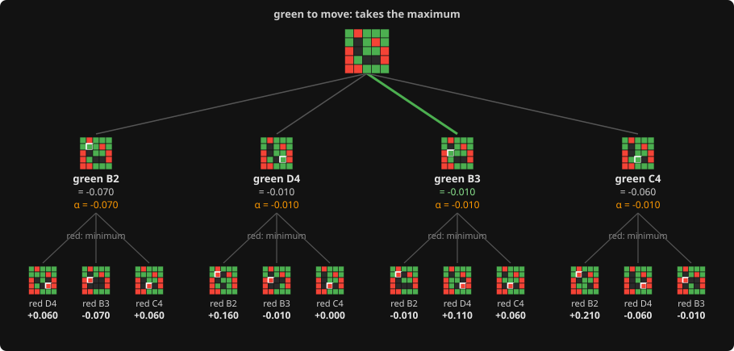

# 5. Minimax, written as negamax

**Code:** [`wasm/src/search.rs`](../wasm/src/search.rs): `negamax` (the loop), `search_root`.

## Minimax

Assume both players play the move that is best for them. Score a position by looking at
every reply, then every reply to that, down to some depth, and evaluate the leaves. At
your own turn take the maximum over children; at the opponent's turn the minimum.

## Negamax

The game is zero-sum: what is good for one side is exactly as bad for the other. So
"the opponent's best" is "the negative of my worst", and the two cases collapse into
one: every node maximises, and scores are negated on the way back up.

The core of `negamax`, with the extras stripped out:

```rust
let mut best = f64::NEG_INFINITY;
for bit in moves {
    let (child, won) = play_move(s.tables, bit, state);
    if won.is_some() {
        best = WIN_SCORE + WIN_DEPTH_BONUS * depth as f64;   // nothing beats winning now
        break;
    }
    let score = -negamax(s, &child, depth - 1, -beta, -alpha);
    if score > best { best = score; }
    ...
}
```

Two conventions make this work:

- every score is for the side to move in that position, so the child's score (for the
  opponent) becomes ours by negation;
- the alpha-beta window is passed as `(-beta, -alpha)`, because the child sees the game
  from the other side (see [Alpha-beta](06-alpha-beta.md)).

There is no `maximizing_player` flag anywhere, and the evaluation is always called for
the side to move. That removes the class of bug the first version of this engine had,
where the heuristic was computed for the wrong player at odd depths.

## Worked example, depth 2

The same real position as on the [alpha-beta page](06-alpha-beta.md): green to move,
four empty squares, every leaf scored by the static [evaluation](04-evaluation.md).
Here the whole tree is searched, with no pruning.



**As minimax.** Under each green move, red picks the reply worst for green; green then
picks the best of those:

| green's move | red's replies (score for green) | red picks | value |
|---|---|---|---|
| B2 | D4 +0.060, B3 -0.070, C4 +0.060 | B3 | -0.070 |
| D4 | B2 +0.160, B3 -0.010, C4 +0.000 | B3 | **-0.010** |
| B3 | B2 -0.010, D4 +0.110, C4 +0.060 | B2 | **-0.010** |
| C4 | B2 +0.210, D4 -0.060, B3 -0.010 | D4 | -0.060 |

Green's best is -0.010, shared by D4 and B3; the root keeps the first one found, D4.

**As negamax**, one branch in detail. The leaves under D4 have green to move, so their
scores are already for the side to move there: +0.160, -0.010 and +0.000. Red's node
negates them to get its own view: -0.160, +0.010, -0.000. Red **maximises**: +0.010,
the reply B3. Back at the root, that is negated once more for green: **-0.010**.

Same answer as minimax, with one rule at every node: take the maximum of the negated
children. No node needs to know whose turn it is.

## Where the root differs

`search_root` is the same loop over the root's moves but keeps the best move as well as
the score, and hands a lost position to [`best_losing_move`](13-lost-positions.md).

---

<sub>← [4. Evaluation](04-evaluation.md) · [index](README.md) · [6. Alpha-beta pruning](06-alpha-beta.md) →</sub>
