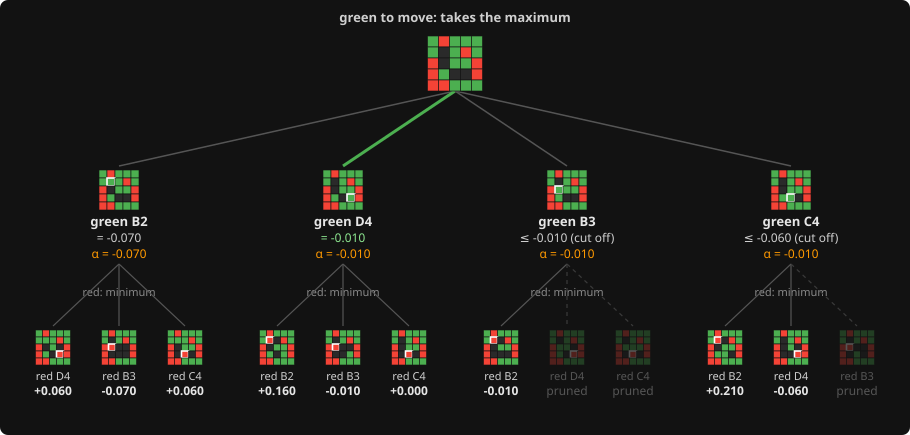

# 6. Alpha-beta pruning

**Code:** [`wasm/src/search.rs`](../wasm/src/search.rs): `negamax` (the `alpha`/`beta` handling), the
`alpha_beta_matches_plain_minimax` test in [`wasm/tests/ai.rs`](../wasm/tests/ai.rs).

## The idea

Plain minimax visits every node. With about 20 legal moves and depth 5 that is
20^5 = 3.2 million leaves. Alpha-beta gives the identical answer while skipping most of
them.

Carry two bounds down the tree:

- `alpha`: the best score the side to move is already guaranteed somewhere else.
- `beta`: the best score the opponent is already guaranteed somewhere else.

At any node, if a move scores `>= beta`, stop looking at this node's other moves. The
opponent already has a line elsewhere worth `beta` to them; this node gives them
something worse, so they will never let the game reach it. Whatever the remaining moves
score cannot change the answer at the root. That early exit is the **cut-off**.

In negamax form:

```rust
let score = -negamax(s, &child, depth - 1, -beta, -alpha);
if score > best { best = score; best_bit = bit; }
if best > alpha { alpha = best; }
if alpha >= beta {
    s.killers[depth as usize] = bit;     // remember what cut off (see Move ordering)
    break;                               // cut-off
}
```

The window `(alpha, beta)` becomes `(-beta, -alpha)` for the child because the child
scores from the other side's point of view.

## Worked example

A real position near the end of a game, green to move, with four empty squares: B2, D4,
B3 and C4. Each green move leaves three replies for red, so the whole two-ply tree has
twelve leaves, small enough to draw. Each leaf is scored with the static
[evaluation](04-evaluation.md), for green.



Read it top to bottom, left to right, in the order the search does. Green takes the
**maximum** over its moves; red takes the **minimum** over its replies (the code does
the same thing with [negation](05-negamax.md)). **α** is the best value green is already
guaranteed from the moves searched so far.

| green's move | red's replies, in the order tried (score for green) | value of the move | α after |
|---|---|---|---|
| B2 | D4 +0.060, B3 -0.070, C4 +0.060 | -0.070 | -0.070 |
| D4 | B2 +0.160, B3 -0.010, C4 +0.000 | -0.010 | -0.010 |
| B3 | B2 -0.010, ~~D4~~, ~~C4~~ | at most -0.010 | -0.010 |
| C4 | B2 +0.210, D4 -0.060, ~~B3~~ | at most -0.060 | -0.010 |

1. **B2.** Nothing is known yet, so all three replies are searched. Red picks the worst
   for green, B3 at -0.070. Green is now guaranteed at least that: **α = -0.070**.
2. **D4.** All three replies are needed again, because each could still leave D4 better
   than -0.070. Red's best is B3 at -0.010, better for green than B2 was:
   **α = -0.010**, and D4 is the move to beat.
3. **B3.** Red's first reply, B2, already holds green to -0.010. Red will pick that reply
   or something even worse for green, so B3 is worth **at most** -0.010, no better than
   D4. The other two replies cannot change that, and are never searched: the **cut-off**.
4. **C4.** The first reply scores +0.210, which on its own would make C4 great, so the
   search continues. The second, D4 at -0.060, caps C4 at -0.060, worse than D4's
   -0.010. The third reply is skipped.

Three of the twelve leaves were never generated, and the answer is exactly what a full
search gives: green plays D4. Near the root of a real search each skipped "leaf" is a
whole subtree, which is where the savings come from.

The tree is drawn by [`wasm/examples/tree_diagram.rs`](../wasm/examples/tree_diagram.rs),
which also prints the table above.

## Fail-soft and bounds

The code returns `best` even when it is outside the window ("fail-soft"). The returned
value is then not the exact score but a bound:

- `best >= beta`: the true score is at least `best` (a lower bound; the search was cut off).
- `best <= alpha_in`: the true score is at most `best` (an upper bound; nothing reached alpha).
- otherwise exact.

The [transposition table](09-transposition-table.md) records which of the three it was.

## Why it gives the same answer

The pruned branches could only have produced scores the parent would reject anyway. The
test `alpha_beta_matches_plain_minimax` checks this on random positions: a plain
full-width search and the pruned search return exactly the same value, to 1e-12.

## How much it saves

With the best move always tried first, alpha-beta visits about `2 * b^(d/2)` leaves
instead of `b^d`: depth 6 costs about what depth 3 cost before. With bad ordering it
degrades back towards plain minimax, which is why [Move ordering](07-move-ordering.md)
matters so much.

---

<sub>← [5. Minimax, written as negamax](05-negamax.md) · [index](README.md) · [7. Move ordering](07-move-ordering.md) →</sub>
