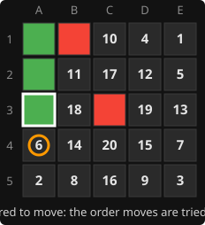

# 7. Move ordering

**Code:** [`wasm/src/search.rs`](../wasm/src/search.rs): `ordered_moves`, `Evaluator::new` (the `move_order`
part), the `killers` field of `Search`, the table probe at the top of `negamax`.

## Why it matters

Alpha-beta cuts off only after it has seen a move good enough to refute the position.
Try the refutation first and the rest of the node is skipped; try it last and the node
costs as much as plain minimax. The engine uses three cheap sources of "probably good",
in this order:

```rust
fn ordered_moves(ev: &Evaluator, empty: u32, first: Bit, killer: Bit) -> Vec<Bit> {
    let mut out = Vec::with_capacity(empty.count_ones() as usize);
    if first & empty != 0 { out.push(first); }                 // 1. table move
    if killer & empty != 0 && killer != first { out.push(killer); }   // 2. killer move
    out.extend(ev.move_order.iter().copied().filter(|&b| b & empty != 0 && b != first && b != killer));  // 3. static order
    out
}
```

## 1. The table move

If this position (or a symmetric twin) was searched before, the
[transposition table](09-transposition-table.md) remembers which move was best. Even
when the stored search was too shallow to reuse its score, its best move is the best
first guess available. With iterative deepening every iteration hands the next one a
table full of these.

## 2. Killer moves

`killers[depth]` is the move that most recently caused a cut-off at that depth:

```rust
if alpha >= beta {
    s.killers[depth as usize] = bit;
    break;
}
```

Sibling positions in the tree are nearly identical (they differ by one move a level
up), so the move that refuted one sibling usually refutes the next. Trying it second
costs nothing when it is wrong and cuts the node off at once when it is right.

Measured on the AI's reply to a centre opening at depth 5, before the table existed:

| ordering | nodes | time |
|----------|-------|------|
| static order only | 336,000 | 2.5 s |
| static order + killers | 60,000 | 0.4 s |

## 3. The static order: corners first

`Evaluator::new` sorts the 25 squares by distance to the nearest corner:

```rust
let corner_distance = |i: usize| {
    let (r, c) = index_to_square(i);
    r.min(ROWS - 1 - r) + c.min(COLS - 1 - c)
};
order.sort_by_key(|&i| corner_distance(i));   // stable: ties keep index order
```

So the order is A1, E1, A5, E5, then the squares next to corners, and the centre last.
This matches what the evaluation rewards (corners and edges), so strong moves tend to
come early. Centre-first ordering was tried first: it visited about four times more
nodes at depth 6.

The static order is also the **tie-break**: `search_root` only replaces its best move
on a strictly higher score, so among equal moves the first in this order wins. That is
why the AI opens in a corner.

## Worked example

From a real game: after 1. A1 C3 2. A2 B1 3. A3, red is to move with 20 empty squares.
The numbers are the static order, corners first, then the edge squares next to them,
and the centre last:



That order is only the fallback. In the real search two moves jump the queue:

- **The table move.** Iterative deepening has already searched this position one ply
  shallower, and the table remembers its best move. Here that is A4 (the circle), the
  only move that holds, so it is tried **first** instead of sixth.
- **The killer.** At deeper nodes, whichever red move last caused a cut-off at the same
  depth is tried second.

With A4 first, its score becomes the bar every other move has to beat, and most of them
are refuted by their first reply, as in the [alpha-beta example](06-alpha-beta.md). Had
A4 come sixth, each of the five moves before it would have needed a full search.

---

<sub>← [6. Alpha-beta pruning](06-alpha-beta.md) · [index](README.md) · [8. Quiescence search](08-quiescence.md) →</sub>
