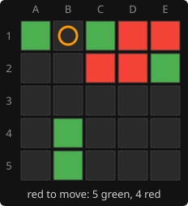
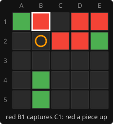
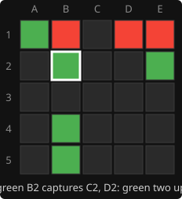

# 8. Quiescence search

**Code:** [`wasm/src/search.rs`](../wasm/src/search.rs): `quiescence`, `capture_moves`,
`Evaluator::has_threat`, `QUIESCENCE_DEPTH`.
**Experiment:** [`wasm/examples/experiment_quiescence.rs`](../wasm/examples/experiment_quiescence.rs).

## The problem: the horizon effect

A search that looks a fixed number of plies ahead has to stop somewhere and ask the
[evaluation](04-evaluation.md) how good the position is. It stops at an arbitrary moment,
often in the middle of an exchange of captures, and then judges a position that is about
to change completely. This is the
[horizon effect](https://en.wikipedia.org/wiki/Horizon_effect), a long-known problem in
chess programs.

A real example, found by searching random positions for exactly this pattern:

  

1. **Red to move**, green five pieces to red's four. Red plays B1, and green's C1, sitting
   between B1 and red's D1, is captured.
2. **A search that stops here** sees red a piece up. The evaluation for green is -0.06:
   red looks to have won something.
3. **One ply later** green plays B2, and red's C2 and D2, sitting between B2 and green's
   E2, are both captured. Green is now two pieces up, and the evaluation for green is
   +0.07.

A search whose horizon falls between steps 2 and 3 believes B1 wins a piece. It will
steer towards B1, or towards positions that allow it, for a gain that does not exist.

## The fix: keep searching until the position is quiet

[Quiescence search](https://en.wikipedia.org/wiki/Quiescence_search) replaces the
evaluation at the leaves. Instead of judging the position immediately, it keeps
searching, but **only capturing moves**, until no capture is pending:

```rust
pub fn quiescence(s: &mut Search, state: &State, mut alpha: f64, beta: f64, qdepth: u32) -> f64 {
    let (mine, theirs) = (state.boards[state.current], state.boards[1 - state.current]);
    if ev.has_threat(t, mine, theirs) {
        return WIN_SCORE;                  // we complete a square next move
    }
    let stand_pat = ev.evaluate(t, state);
    if qdepth == 0 || stand_pat >= beta {
        return stand_pat;
    }
    if stand_pat > alpha { alpha = stand_pat; }
    let mut best = stand_pat;
    for bit in capture_moves(t, state) {
        let (child, won) = play_move(t, bit, state);
        if won.is_some() { return WIN_SCORE; }
        let score = -quiescence(s, &child, -beta, -alpha, qdepth - 1);
        if score > best { best = score; }
        if best > alpha { alpha = best; }
        if alpha >= beta { break; }
    }
    best
}
```

Three ideas are in there.

> [!TIP]
> **"Stand pat"** is poker slang: to keep the hand you have rather than draw new cards.
> Here it means the side to move may decline every capture and accept the static
> evaluation of the position as it is.

- **Standing pat.** The side to move is never forced to capture, so the result is at
  least `stand_pat`. Captures can only improve on it; `best` starts there. Without this
  the search would assume a capture is compulsory and overrate positions where the only
  captures are bad.
- **Captures only.** `capture_moves` walks the empty squares and keeps those where some
  ray holds a run of opponent pieces closed by one of ours, using the same precomputed
  rays as the [rules](03-captures-and-wins.md). Captures are rare, so this tree is narrow.
- **A threat is a win.** If the side to move already owns three corners of a square with
  the fourth empty, it wins next move, so the leaf scores as a win without searching.

`QUIESCENCE_DEPTH` (4) caps how long an exchange is followed.

In the example: a normal search stopping after B1 hands the position to `quiescence`.
Green is to move and has a capture, B2. Standing pat gives -0.06; searching B2 gives
+0.07; green takes the better, and the leaf is scored +0.07. B1 no longer looks like a
gain.

## Does it pay for itself?

Quiescence costs nodes: every leaf now also scans for captures, and some leaves grow
small capture trees. The experiment plays the [arena](15-measuring-strength.md)'s games,
the AI as red against a depth-5 opponent that blunders 10% of the time, with quiescence
on and off:

```bash
cd wasm && cargo run --release --example experiment_quiescence -- 100
```

| red's search | without quiescence | with quiescence |
|--------------|--------------------|-----------------|
| fixed depth 5 | 23 of 100 | 92 of 100 |
| page budget, 400k nodes | 96 of 100 | 95 of 100 |

"Without" still keeps the one-move-win check; it only removes the capture search.

The two rows tell different stories, and both are real:

- **At a fixed depth it is decisive.** With the horizon always at the same ply, the
  search keeps falling for exchanges like the one above, and loses three games in four.
- **At the page's node budget it makes no measurable difference** in this arena.
  Iterative deepening under a budget ends at different depths from move to move, and a
  deeper search sees most of these exchanges directly; against this opponent that is
  enough. The first version of this page claimed quiescence was a clear win for the
  page's play; that came from a fixed-depth comparison and is not supported by this
  measurement.

It stays in the engine because it costs nothing measurable at the budget, it makes the
fixed-depth searches behind the offline [book](14-opening-book.md) reliable, and a stronger or less blundering
opponent may separate the two where this arena does not. That last point is untested.

---

<sub>← [7. Move ordering](07-move-ordering.md) · [index](README.md) · [9. The transposition table](09-transposition-table.md) →</sub>
