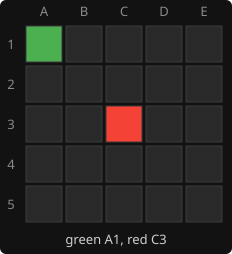
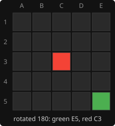

# 10. Symmetry

**Code:** [`wasm/src/game.rs`](../wasm/src/game.rs): `symmetry`, `transform`, `canonical_key`, the
`sym_square` / `sym_rows` / `sym_inverse` tables built in `build_tables`; the
`symmetric_positions_share_a_key` test in [`wasm/tests/ai.rs`](../wasm/tests/ai.rs).

## The idea

The board has eight symmetries: four rotations and four reflections. A position and its
mirror image play out identically, so they should share one transposition-table entry.
On top of that, swapping the colours and the side to move gives a position with the
same value for the side to move, which is the convention every score uses. So each
position has up to 16 equivalents, and the table key is the smallest key among them.

## The eight board symmetries

```rust
fn symmetry(s: usize, r: usize, c: usize) -> (usize, usize) {
    let n = ROWS - 1;
    match s {
        0 => (r, c),             // identity
        1 => (c, n - r),         // rotate 90
        2 => (n - r, n - c),     // rotate 180
        3 => (n - c, r),         // rotate 270
        4 => (r, n - c),         // mirror left-right
        5 => (n - r, c),         // mirror top-bottom
        6 => (c, r),             // transpose
        _ => (n - c, n - r),     // anti-transpose
    }
}
```

`build_tables` turns this into two lookup tables per symmetry:

- `sym_square[s][i]`: where square `i` lands. Used to map a move between frames.
- `sym_rows[s][r][bits]`: the transformed bitboard of row `r` holding the 5-bit pattern
  `bits`. A whole board is transformed with five reads and four ORs:

```rust
pub fn transform(t: &Tables, s: usize, board: u32) -> u32 {
    let rows = &t.sym_rows[s];
    let mut out = 0;
    for (r, row) in rows.iter().enumerate() {
        out |= row[(board >> (r * COLS)) as usize & 0b11111];
    }
    out
}
```

`sym_inverse[s]` is found at start-up by testing which symmetry undoes `s` on every
square.

## The canonical key

```rust
pub fn canonical_key(t: &Tables, state: &State) -> (u64, usize) {
    let mut best = (u64::MAX, 0);
    for s in 0..SYMMETRIES {
        let (a, b) = (transform(t, s, state.boards[0]), transform(t, s, state.boards[1]));
        let same = State { boards: [a, b], current: state.current }.key();
        let swapped = State { boards: [b, a], current: 1 - state.current }.key();
        let k = same.min(swapped);
        if k < best.0 { best = (k, s); }
    }
    best
}
```

Eight symmetries, two colourings each, sixteen candidate keys; keep the smallest and
remember which board symmetry produced it. Cost: 8 x 2 x 5 = 80 table reads plus 16 key
computations, about 15% of a node's time.

## Moves must be mapped too

The table stores the best move in the canonical frame. On a store, the move found in
the real frame is pushed through `sym`; on a hit, the stored move is pulled back through
`sym_inverse[sym]`:

```rust
// store
let best_canonical = 1 << s.tables.sym_square[sym][bit_index(best_bit)];
// probe
first = 1 << s.tables.sym_square[s.tables.sym_inverse[sym]][bit_index(e.best)];
```

Colour swapping does not move squares, so it needs no mapping. When a position is
symmetric under several transforms, any of their best moves is an equally good move
in the current frame, and legality is re-checked before use.

## Worked example

Green on A1, red on C3, red to move. Its rotate-180 twin is green on E5, red on C3.

 

Both produce the same 16 candidate keys, so both get the same canonical key. If the
first one was searched and its best move was B2, the twin's probe finds the entry and
maps B2 through the inverse of whichever symmetry won, giving D4 for the rotated board.

## Effect

Depth-7 reply to a centre opening: 597k nodes before, 145k after, roughly 4x fewer in
the opening where positions are most symmetric. Later in the game positions become
asymmetric and the gain fades, but the cost stays small.

The [opening book](14-opening-book.md) uses the same tables to map its six entries onto
all 25 first moves.

---

<sub>← [9. The transposition table](09-transposition-table.md) · [index](README.md) · [11. Iterative deepening and the node budget](11-iterative-deepening.md) →</sub>
