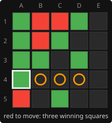

# 13. Lost positions

**Code:** [`wasm/src/search.rs`](../wasm/src/search.rs): `best_losing_move`, the hand-off at the end of
`search_root`, `Evaluator::winning_squares`, `Evaluator::count_threats`.

## The problem

When every move loses, alpha-beta gives the root an exact score only for the first
move that establishes the loss; every later move is searched with a narrowed window and
comes back as a bound, not a value. So "all moves are equally lost" is invisible to the
root loop, and the engine simply kept the first move in its ordering, which meant
playing the first empty corner while the opponent had a double threat elsewhere. Legal,
pointless, and it looks broken.

## The fix: re-score, then rank by what a human would do

`search_root` notices when the best score is a forced loss and hands over:

```rust
match best {
    Some((_, score)) if score <= -WIN_SCORE => Some(best_losing_move(s, state, depth)),
    other => other,
}
```

`best_losing_move` searches every move again with a full window, which is cheap because
the table already holds most of the subtrees, and ranks them:

```rust
let their_wins = s.evaluator.winning_squares(s.tables, theirs, mine);
let mut best: Option<(Bit, (f64, i32, bool))> = None;
for bit in ordered_moves(s.evaluator, state.empty(), 0, 0) {
    let (child, _) = play_move(s.tables, bit, state);
    let score = -negamax(s, &child, depth - 1, f64::NEG_INFINITY, f64::INFINITY);
    let threats = s.evaluator.count_threats(s.tables, c_mine, c_theirs) as i32;
    let rank = (score, -threats, bit & their_wins != 0);
    if best.map_or(true, |(_, b)| rank > b) { best = Some((bit, rank)); }
}
```

Tuples compare element by element, so the order of preference is:

1. **Loses latest.** Scores like -1.03 beat -1.07 (the depth bonus makes a later loss
   less negative). The opponent has to keep finding moves.
2. **Leaves the opponent the fewest immediate wins.** Block what can be blocked.
3. **Sits on one of the opponent's winning squares.** Between a block and a capture that
   removes a threat elsewhere, prefer the visible block, which reads as a natural reply.

## Worked example

From a real game: green played A4 and created three winning squares at once, B4, C4 and
D4 (the circles). Red has no defence; each candidate removes one threat and leaves two:



| red plays | what it does | green still wins with |
|-----------|--------------|-----------------------|
| E1 | captures D1, killing the D4 square | B4 or C4 |
| C4 | blocks the 3x3 | B4 or D4 |
| D4 | blocks the 4x4 | B4 or C4 |
| B4 | blocks and captures B3 | C4 or D4 |

All four lose at the same distance and leave two wins, so ranks 1 and 2 tie. Rank 3
prefers a move on a winning square: B4, C4 or D4 rather than the E1 capture on the far
side of the board. A test covers this position.

## Cost

It runs only when the root is lost, which is near the end of a game and shallow, and it
runs under the same node budget, so the timing stays predictable.

---

<sub>← [12. Repetition](12-repetition.md) · [index](README.md) · [14. The opening book](14-opening-book.md) →</sub>
