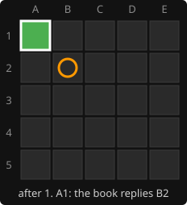
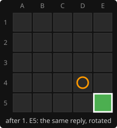
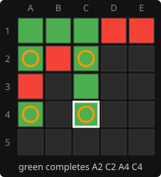

# 14. The opening book

**Code:** [`wasm/src/search.rs`](../wasm/src/search.rs): `OPENING_BOOK`, `book_move`, the check at the top of
`best_move_scored`; [`wasm/src/lib.rs`](../wasm/src/lib.rs): `book_square`; the
`opening_book_replies_through_symmetry` test in [`wasm/tests/ai.rs`](../wasm/tests/ai.rs).

## Why a book

A game against a good opener showed the limit of a few hundred thousand nodes: after
1. A1 the engine replied C3, and green's A1, A2, A3 column down the left edge, anchored
on an uncapturable corner, turned out to be a forced win that takes about 13 plies to
prove. Depth 14 (about 30 minutes offline) shows C3 loses and B2 or D4 hold. The page
cannot afford that depth per move, but it can afford a table computed once.

## The table

There are 25 first moves but only 6 distinct ones; the rest are rotations or reflections.
The book stores the 6 and maps through the [symmetry](10-symmetry.md) tables:

```rust
const OPENING_BOOK: [(usize, Option<usize>); 6] = [
    (0, Some(6)),   // A1 -> B2  (-0.27; C3, the search's own choice, loses in 13 plies)
    (1, Some(0)),   // B1 -> A1  (-0.20; B2/D4 -0.27; E1, A5, D1, A2, A4 lose)
    (2, Some(0)),   // C1 -> A1  (-0.09, tied with E1)
    (6, Some(0)),   // B2 -> A1  (-0.09)
    (7, Some(0)),   // C2 -> A1  (0.00, tied with E1; A1/E1/B1 all 40/40 in play)
    (12, Some(0)),  // C3 -> A1  (see below)
];

pub fn book_move(state: &State) -> Option<Bit> {
    if state.occupied().count_ones() != 1 { return None; }
    let square = bit_index(state.occupied());
    for s in 0..SYMMETRIES {
        let canonical = t.sym_square[s][square];
        if let Some(&(_, Some(reply))) = OPENING_BOOK.iter().find(|(first, _)| *first == canonical) {
            return Some(1 << t.sym_square[t.sym_inverse[s]][reply]);
        }
    }
    None
}
```

Find a symmetry that carries the opponent's square onto a book square, take the book's
reply, and carry it back through the inverse. `best_move_scored` consults the book
before searching, so a book reply costs nothing and the page shows it instantly.

## Worked example

 

Green opens E5 (square 24). Rotate-180 maps it to A1 (square 0), which is in the book
with reply B2 (square 6). The inverse of rotate-180 is rotate-180, which maps square 6
to square 18, D4. So the AI answers E5 with D4, the mirror of B2. The test checks this
pair and that a two-piece position gets no book move.

## Scores are not enough: validate by play

The C3 entry is the cautionary tale. At depth 14 the edge midpoint C5 scored -0.13 and
the corner A1 -0.16, so C5 went into the book. The next arena run dropped from 39 wins
in 40 to 14. Bisecting to the entry and then playing 40 games from each reply settled
it: C5 won 13, A1 won 40. A 0.03 gap at depth 14 is evaluation noise; the corner is
right. Every entry is now checked with the arena before it is trusted.

## Recomputing or extending an entry

```bash
cd wasm && cargo run --release --example analyse -- "1. C2" 14 16       # depth 14, 16 threads: minutes
cargo run --release --example validate_reply -- C2 A1 E1 B1 40          # then validate by play
```

Take the top replies from the first command, play them with the second, and put the one
that wins in play into `OPENING_BOOK` as `(square, Some(reply))`. All six entries were
made this way; C2's candidates A1, E1 and B1 each won 40 of 40, so the top-scoring
corner was kept.

## A1 is a first-player win

At depth 14, B2 and D4 held with a score of -0.27. At depth 16, searched with the
[parallel search](17-parallel-search.md) after the repetition-store fix, **every one of
red's 24 replies to A1 loses**:

| red's reply | score | meaning |
|-------------|-------|---------|
| B2, D4 | -1.010 | green's winning square lands on the 16th ply after the reply |
| 13 others (C1, D1, A2, B1, A3, A4, E1, A5, D2, D3, B4, C4, C3) | -1.030 | two plies sooner |
| C2, E2, B5, E3, E4, B3, D5, E5, C5 | -1.050 | sooner still |

This is a proof as far as the engine is sound: a forced win is only ever reported when
every defence ends in an actual completed square, or an unanswerable three-corner
threat at the horizon, and since the fix the single-threaded and 16-thread searches
give identical scores. It is consistent with the shallower results: a win landing on
ply 16 is invisible at depth 14 and shows exactly at 16.

What a forced win looks like in practice, against a weaker reply: after
1. A1 E1 2. A2 D1 3. B1 B2 4. C2 B2 5. C3 B2 6. C1 A3 7. A4 A3 8. C4, green completes the
square A2 C2 A4 C4 (the circles). Red's B2 is captured and replayed three times along the
way.



The book keeps B2 as the reply to A1. Against perfect play it loses last; against
anyone else the game is a normal game.

## All six openings at depth 16

The other five distinct first moves were searched the same way (each about three hours
on 16 threads). None is a forced win for green, and every book reply was confirmed:

| green opens | red's best reply | score for red | replies that hold | verdict at depth 16 |
|-------------|------------------|---------------|-------------------|---------------------|
| A1 (corner) | B2, D4 | -1.01 | none | **green wins by force** |
| B1 (edge, next to a corner) | A1 | -0.20 | A1 only | draw by repetition; any other reply loses |
| C1 (edge midpoint) | A1, E1 | -0.155 | 5 | green slightly better |
| B2 (diagonal from a corner) | A1 | -0.145 | 7 | green slightly better |
| C2 (next to the centre) | A1, E1 | -0.005 | 7 | level |
| C3 (centre) | the corners and edge midpoints | -0.20 | 8 | draw by repetition |

A score of exactly -0.200 is the [draw-contempt](12-repetition.md) value: red's best is a
line that repeats. Two patterns stand out. Red's best reply is a corner in every opening
except A1, where the corner is taken; and green's only winning first move is the corner.
Among the rest, the closer green starts to the centre, the more even the game.

---

<sub>← [13. Lost positions](13-lost-positions.md) · [index](README.md) · [15. Measuring strength](15-measuring-strength.md) →</sub>
