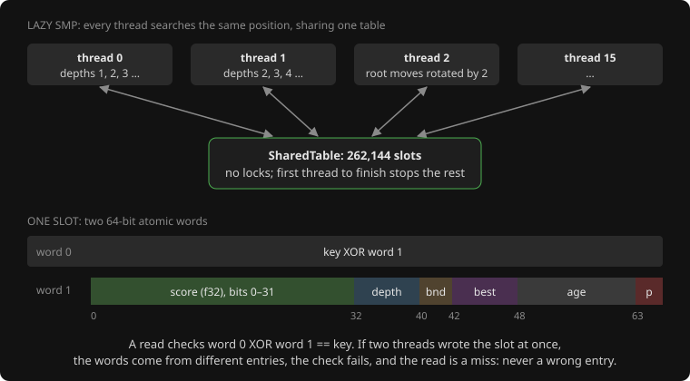

# 17. Parallel search (native tools only)

**Code:** [`wasm/src/parallel.rs`](../wasm/src/parallel.rs): `SharedTable`, `best_move_parallel`,
`root_scores_parallel`, `principal_variation_parallel`; [`wasm/src/search.rs`](../wasm/src/search.rs): the `Table`
trait, `Search::with_evaluator`, `Search::with_stop`; [`wasm/tests/parallel.rs`](../wasm/tests/parallel.rs).

## Scope

The browser build stays single-threaded: WebAssembly threads need cross-origin headers
GitHub Pages cannot set, and the page's search already takes a fraction of a second. The
parallel code is for the offline tools, where a depth-14 search of one opening takes
half an hour on one core and a 16-core machine was sitting idle. It is compiled only for
native targets (`#[cfg(not(target_arch = "wasm32"))]`).

## The seam: a `Table` trait

The one thing threads must share is the transposition table, and the single-threaded
one is a plain `Vec` behind `Cell`s. So the search now talks to a trait:

```rust
pub trait Table {
    fn get(&self, key: u64) -> Option<TtEntry>;
    fn put(&self, entry: TtEntry);          // &self: a shared table is interior-mutable
    fn age(&self) -> u32;
    fn bump_age(&self);
}
```

`Search` holds `Option<&dyn Table>`, plus an optional evaluator (so each thread can
use its own move order) and an optional stop flag checked where the node budget is
checked. Nothing else in the search changed, which is the point: the parallel driver
runs the existing search several times.

## The shared table, lock-free

Each slot is two atomic 64-bit words. The entry is packed into one word (score as
`f32` bits, depth, bound, best-move square, age) and the other word holds the key
XOR-ed with it:

```rust
fn get(&self, key: u64) -> Option<TtEntry> {
    let w0 = slot[0].load(Relaxed);
    let w1 = slot[1].load(Relaxed);
    (w0 ^ w1 == key && w1 != 0).then(|| unpack(key, w1))   // torn write => mismatch => miss
}
```

Two threads storing to the same slot at once can interleave their two words. Then
`w0 ^ w1` is not the key of either entry, the read is a miss, and nothing wrong is ever
used. No locks, no waiting, and the cost of the rare collision is one lost entry. The
same replacement policy as the single-threaded table applies (`should_replace`).

## Lazy SMP: `best_move_parallel`



Every thread runs the same iterative deepening on the same position over the shared
table. To stop them doing identical work, odd-numbered threads start one ply deeper,
each thread starts from a different root move (the previous iteration's best stays in
front; the rest of the root order is rotated by the thread index), and the first few
entries of the static order are nudged per thread. They exchange discoveries through
the table: when thread 3 finishes searching a subtree, thread 0 finds the result there
and skips it. The first thread to complete the target depth, or to find a forced
result, sets the stop flag; the others abort their current iteration (nothing
half-finished is stored), and the deepest completed result wins.

It sounds too simple to work. It is what Stockfish does, and the reason it works is
that the table *is* the search's memory: sharing it shares the work.

Two things that did not work on the way: rotating the *whole* static order per thread
made the high-numbered threads search in a bad order and prune badly, so 8 and 16
threads were slower than 4; and with only that nudge and no root rotation, the threads
duplicated each other and lazy SMP gained nothing at all.

## Measured (16-core machine, position after 1. A1)

| depth | threads | score every reply | single best move |
|-------|---------|-------------------|------------------|
| 11 | 1 | 27.7 s | 1.9 s |
| 11 | 4 | 10.1 s | 1.7 s |
| 11 | 16 | 4.0 s | 1.1 s |
| 12 | 1 | 105.8 s | 5.6 s |
| 12 | 16 | 14.0 s (7.5x) | 2.8 s (2x) |

Root splitting scales well because the moves are independent; lazy SMP gains less
because the threads overlap, which is normal for it. The scoring phase is the one that
dominates the offline searches, so a depth-14 book entry now takes minutes rather than
half an hour.

## The bug the threads exposed

The first parallel runs disagreed with each other and with the single-threaded search
on the position after 1. A1 B2: root splitting said green had four winning moves, lazy
SMP's line started with a move worth +0.22, and the earlier single-threaded run said the
position was merely +0.27 for green. None of it was a race. The table was storing draw
scores that came from repetitions on one line and serving them on other lines where the
position was not a repetition (see the [transposition table](09-transposition-table.md)).
Single-threaded that was rare; sixteen threads filling one table made it constant. Once
path-dependent values stopped being stored, the strategies agreed. The lesson for
testing parallel code: a disagreement between the threaded and unthreaded results is the
symptom to chase, and the cause may be a pre-existing hole rather than a race.

## Root splitting: `root_scores_parallel`

Scoring every root move with a full window, the slow second phase of the analyse tool,
is embarrassingly parallel: deal the moves out round-robin and let each thread score its
share over the shared table. Scores are exact either way, so the result is the same as
single-threaded up to the `f32` rounding of table entries.

## Tests

- **Torn reads.** Two threads hammer eight slots with 200,000 conflicting writes each;
  every read must be a miss or a self-consistent entry with the right key.
- **Agreement.** On a dozen random positions, parallel root scores at 2 and 4 threads
  equal the single-threaded scores per move within 1e-4. (Moves with tied scores may
  come out in a different order; the first version of the test wrongly demanded the
  same order and failed every run, which is the kind of "race" that is really a test bug.)
- **Legality and depth.** The parallel best move is legal, reaches the requested depth,
  and with one thread reproduces the serial move exactly.

All run five times in a row before the code was committed, since a race that shows up
one run in ten would pass a single run.

## Use

```bash
cd wasm && cargo run --release --example analyse -- "1. A1" 14 16   # 16 threads
```

The single-threaded path is the default (`threads` = 1) and is what the tests compare
against.

---

<sub>← [16. WebAssembly and the page](16-wasm-and-page.md) · [index](README.md)</sub>
